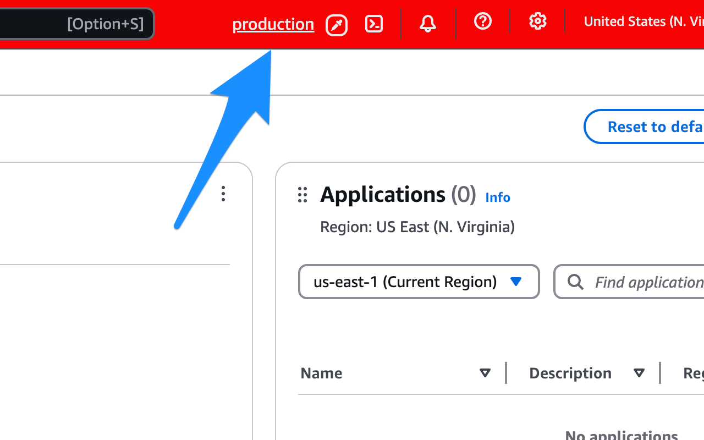
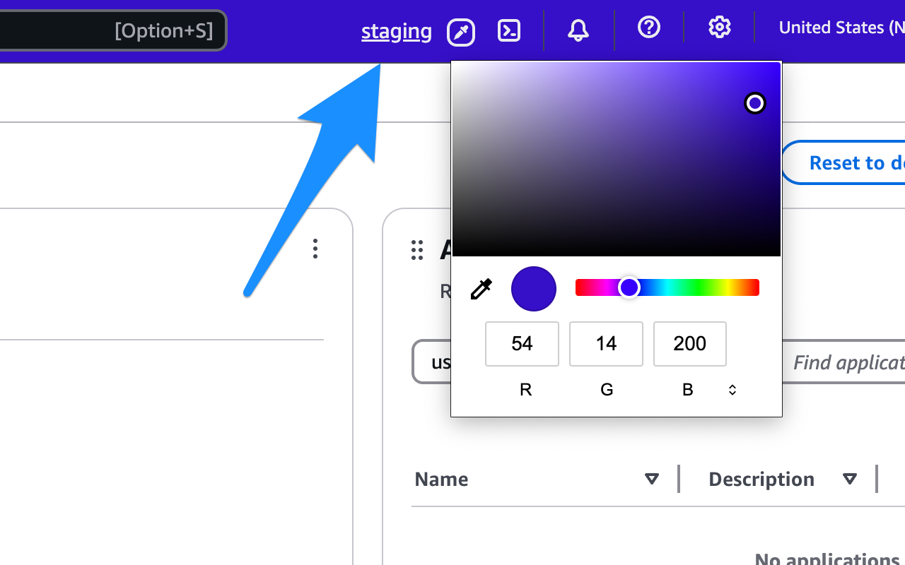

# multiple-aws-sessions

### Table of Contents

- [What's it for](https://github.com/arkadiyt/multiple-aws-sessions?tab=readme-ov-file#whats-it-for)
- [Installation](https://github.com/arkadiyt/multiple-aws-sessions?tab=readme-ov-file#installation)
- [How it works](https://github.com/arkadiyt/multiple-aws-sessions?tab=readme-ov-file#how-it-works)
- [Permissions](https://github.com/arkadiyt/multiple-aws-sessions?tab=readme-ov-file#permissions)
- [Security](https://github.com/arkadiyt/multiple-aws-sessions?tab=readme-ov-file#security)

### What's it for

Engineers often have a need to sign into multiple AWS accounts (or even a single account with multiple roles), which AWS didn't allow until recently (and now supports with some limitations).

This extension lets you sign into as many AWS accounts as you want in a single browser window, makes the sign in more transparent, and lets you select a header color for each AWS account.

 

### Installation

#### From webstores:

- [Chrome](https://chromewebstore.google.com/detail/multiple-aws-sessions/ehffbdpahpebdgpmnecccpfmbokeohop)
- [Firefox](TODO)
- [Edge](TODO)
- [Opera](TODO confirm https://addons.opera.com/en/extensions/details/multiple-aws-sessions/)

#### From source:

1. Run these commands:

```
git clone https://github.com/arkadiyt/multiple-aws-sessions
cd multiple-aws-sessions
npm install
make build
```

2. Install the relevant extension from the `build/` folder

### How it works

See this blog post:

### Permissions

Here are the permissions used by multiple-aws-sessions and why it requests them. See also [PRIVACY.md](https://github.com/arkadiyt/multiple-aws-sessions/blob/main/PRIVACY.md).

- `declarativeNetRequest`: This is used to write rules that determine which cookies get sent with requests from different AWS tabs. It is the heart of this extension
- `storage`: This is used to store cookies and various bookkeeping settings
- `webRequest`: This is used to read Set-Cookie response headers from AWS
- Host permissions for `*://*.aws.amazon.com/*`: This is used to read Set-Cookie response headers from AWS

### Security

See [SECURITY.md](https://github.com/arkadiyt/multiple-aws-sessions/blob/main/SECURITY.md)
